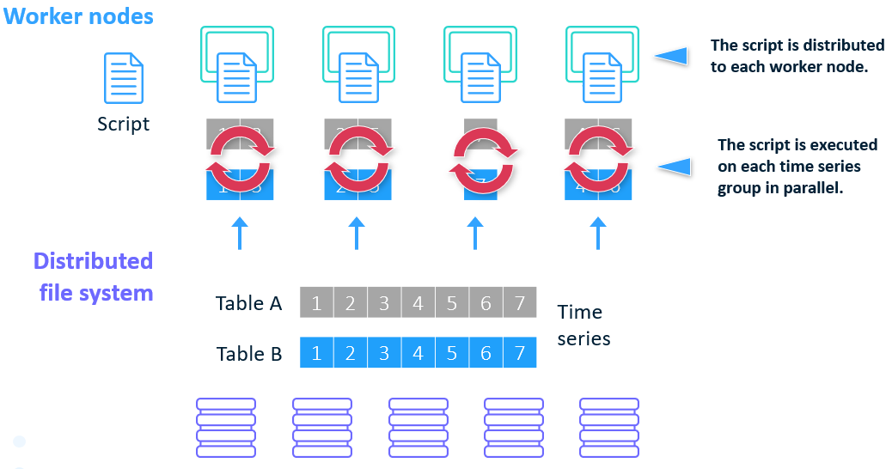

# Scaling Time Series Forecasting with Facebook Prophet and SAS Viya

This repository contains the code used in the blog post [Scaling Time Series Forecasting with Facebook Prophet and SAS Viya](https://sahbichaieb.com/scale-forecast-prophet-viya/)

## Data

- [M5 Competition](https://www.kaggle.com/c/m5-forecasting-accuracy) data on Kaggle.

## Requirements

- SAS Viya Access

- Set up Python environment
    - Install Python and [prophet](https://facebook.github.io/prophet/)

- Configure [EXTLANG](https://go.documentation.sas.com/?cdcId=pgmsascdc&cdcVersion=9.4_3.5&docsetId=castsp&docsetTarget=castsp_extlang_sect001.htm&locale=en)

## References

- [Scalable Cloud-Based Time Series Analysis and Forecasting](https://www.sas.com/content/dam/SAS/support/en/sas-global-forum-proceedings/2018/2027-2018.pdf) Thiago Quirino, Michael Leonard, and Ed Blair, SAS Institute Inc
